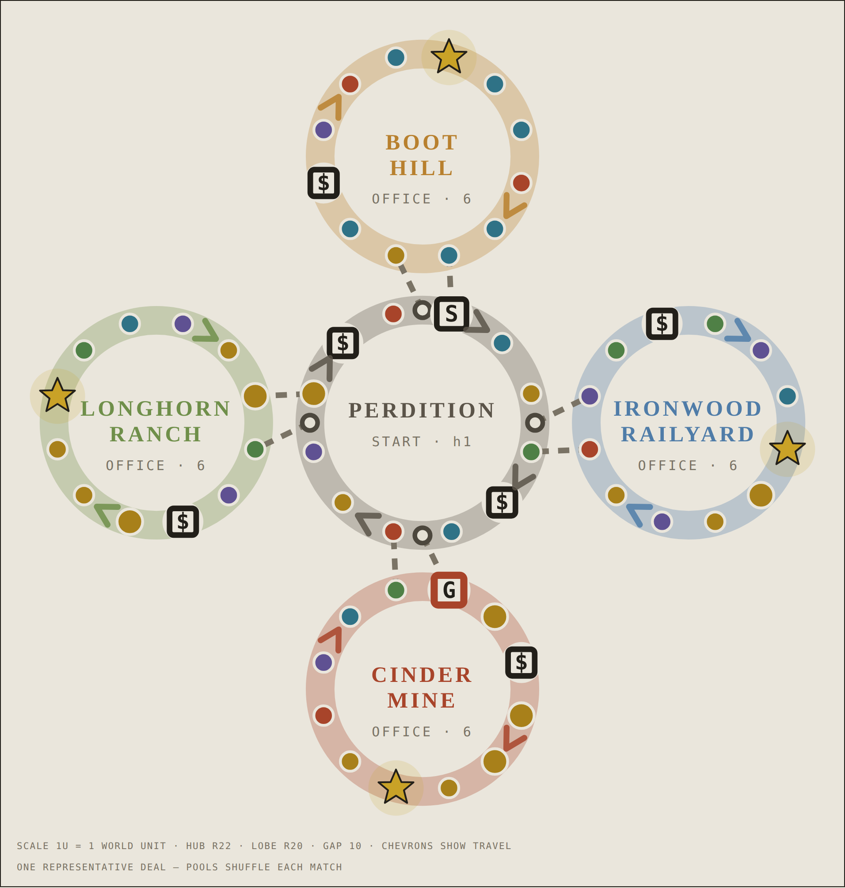

# Star Territory — build spec

**Date:** 2026-08-23
**Branch:** `claude/game-map-design-scov1x`
**Status:** spec. Nothing in `src/` is built yet.
**Companion:** `docs/THIRD_MAP_DESIGN.md` (the analysis and the options this
settles).

Four decisions were taken on the brief and this document is what they turn into:

| Decision | Chosen |
|---|---|
| Architecture | **Map modules** — phase 0 refactor first |
| Theme | **Wild West — the Sheriff's Star** |
| Star acquisition | **Buy + relocate + Shards** |
| Scoring | **Most Stars, coins as tiebreak** |

> **Working title.** `Star Territory` is a placeholder, chosen to sit beside
> *Hundred Block Dash* and *City Circuit*. Rename freely — it appears in exactly
> two places (`MAP_REGISTRY.name` and the briefing copy).

---

## 1. The fiction

The Territory has no law and four days left before the circuit judge arrives.
Whoever has pinned on the most **Sheriff's Stars** by sundown takes the badge.

You buy a Star by posting a bond at a **Territory Office**. There are four, one
deep in each of the four territories. Only one Office is holding a Star at a
time — post the bond and the next Star is dispatched to the Office **farthest
from you**, which is the whole chase.

## 2. Board — the Clover



*Generated from the real layout, not sketched. Interactive version, with the
distance and pool tables:* <https://claude.ai/code/artifact/262ed885-42b9-4d50-aed3-05e740aa50b3>


**60 playable nodes**, the same budget as City Circuit, plus 4 invisible
junctions. A 12-node hub ring, four 12-node territory **lobes**.

> **The lobes are circles, not teardrops.** The first draft of this spec drew
> each territory as a teardrop leaving and rejoining the ring. Laying the nodes
> out numerically killed it: the two sides of a teardrop run **2–6 units apart**
> at every parameter setting tried, against a 16×13 tile — the roads overlap.
> A circular lobe tangent to the ring has no such neck, and its node spacing is
> uniform by construction. Working geometry, verified in §2.6:
>
> ```
> HUB_RADIUS   = 22    // 12 nodes → 11.4 units per step
> LOBE_RADIUS  = 20    // 12 nodes → 10.4 units per step
> LOBE_GAP     = 10    // clearance between hub ring and lobe
> // lobe centre sits at radius 22+10+20 = 52 along its junction's angle;
> // node i at angle (thetaJ + 165° − i·30°) around that centre.
> // Board radius 72. City Circuit's is 58.
> ```

```
                          ⭐ rail_6
                    ╭───── IRONWOOD RAILYARD ─────╮
                    │                             │
                    ╰──── jn_a ── h4 ─────────────╯
                            │
      ⭐ bad_6              h3                    h5 (shop)
   ╭ BOOT HILL ╮            │                      │
   │           ╰── jn_d ── h1 ★START   PERDITION   h6
   │                        │        (hub ring)     │
   ╰────────────── h12 ─────╯                     jn_b
                   │                                │
                h11 (shop)                          ╰── CINDER MINE ──╮
                   │                                   🔒 mine_0      │
                 jn_c ── h10 ──╮                        ⭐ mine_6      │
                    │          ╰── LONGHORN RANCH ──╮   ╰─── h7 ──────╯
                    │              ⭐ ranch_6        │
                    ╰──────────────────────────────╯
```

### 2.1 · Topology

- Hub ring **h1 … h12**, cyclic. `h1` is START.
- Four junctions sit **between** hub nodes: `jn_a` (h3→), `jn_b` (h6→),
  `jn_c` (h9→), `jn_d` (h12→).
- Each junction offers two roads: **stay on the ring**, or **take the territory**.
- A territory is a **teardrop loop**: it leaves at its junction and rejoins the
  ring at the *same* node the ring branch reaches. No tile is ever retraced.

| Junction | Ring option | Territory option | Rejoins at |
|---|---|---|---|
| `jn_a` | `h4` | `rail_0` — 🚂 Ironwood Railyard | `h4` |
| `jn_b` | `h7` | `mine_0` — ⛏️ Cinder Mine 🔒 | `h7` |
| `jn_c` | `h10` | `ranch_0` — 🐎 Longhorn Ranch | `h10` |
| `jn_d` | `h1` | `bad_0` — 🏜️ Boot Hill Badlands | `h1` |

**This is the one real difference from City Circuit, and it is the point.** A
City district is a *parallel route* — taking it still carries you round the ring.
A Territory is a *detour*: 11 extra spaces, out and back, converging exactly where
the ring branch already was. You are spending time, not routing through it. That
is what makes the Star at the far end of it worth going for and not simply
free.

### 2.2 · Distances

Measured by walking the real directed graph, not estimated:

| Trip | Spaces | ≈ turns @3.5 |
|---|---:|---:|
| Hub lap, no territory | 12 | 3.4 |
| Hub lap taking one territory | 23 | 6.6 |
| Hub lap taking all four | 56 | 16 |
| Junction → that territory's Office | 7 | 2.0 |
| START → nearest Office (`rail_6`) | 9 | 2.6 |
| Office → **nearest** other Office | **15** | 4.3 |
| Office → middle Office | **18** | 5.1 |
| Office → **farthest** Office | **21** | 6.0 |

> **Corrected.** An earlier draft of this table estimated 12 / 18. The real
> figures off the graph are **15 / 18 / 21** — every trip is 3–4 spaces longer
> than guessed, and §4.5 is re-derived accordingly.

Because the board is a **directed** cycle, these distances are asymmetric:
`rail_6 → mine_6` is 15 steps but `mine_6 → rail_6` is 21. That is what makes
"the Office farthest from the buyer" a well-defined, always-distinct target, and
it means the dispatch rule needs no tie-breaking in the ordinary case.

The 21-space worst case is the number the design hangs on: long enough to be a
chase, short enough that the trailing player can win it.

### 2.6 · Layout, checked numerically

The layout was generated and stress-tested before being written down. Against
City Circuit's ~10-unit step:

| Measure | Result |
|---|---|
| Step along any road | **10.4 – 11.4 units** (City: ~10) |
| Closest **non-adjacent** pair of nodes | **10.4 units** — a full step apart, nothing crowds |
| Junction → first lobe node | 5.7 |
| Last lobe node → rejoin node | 11.9 |
| Board radius | 72 |

The middle row is the one that matters, and it is what killed the teardrop:
non-adjacent nodes must not be closer than adjacent ones, or the board reads as
a tangle. The hop animation already derives duration from distance
(`TURN_FLOW.md` §3), so the 5.7 / 11.9 link legs need no special handling.

### 2.3 · Fixed squares — 12 of 60

| Node | Type | Note |
|---|---|---|
| `h1` | `start` | The Marshal's Office steps |
| `h5`, `h11` | `shop` | Perdition general stores, full inventory |
| `rail_2`, `mine_2`, `ranch_2`, `bad_2` | `shop` | Territory outfitters, subsets |
| `rail_6`, `mine_6`, `ranch_6`, `bad_6` | `plinth` | **Territory Offices** — new type |
| `mine_0` | `gate` | The rockslide |

**The shop sits at node 2 and the Office at node 6, deliberately.** You walk past
the outfitter *before* you reach the Office, so "spend it on an item or save it
for the Star" is a live question at the moment you have to answer it. That
tension does not exist on either current board.

### 2.4 · The Gate now guards a Star

`mine_0` is the Gate (5d6 ≥ 15, same as City's). Because the Cinder Mine holds
one of the four Offices, **the Gate is worth score, not just coins** — while it is
closed, only three Offices are in rotation and the Star can never be dispatched
to the Mine. Breaking it opens a fourth destination for the rest of the match.

This is a straight upgrade on City's Gate, which only guarded a coin district.

### 2.5 · Space pools — 48 random slots

Counts are exact; the pools shuffle into fixed slots the way `initCityBoard()`
already does.

| Territory | Slots | Pool |
|---|---:|---|
| **Perdition** (hub) | 9 | 2 coin · 1 coin_big · 1 duel · 1 magnet · 1 mystery · 1 boost · **1 trap · 1 lose** |
| 🏜️ **Boot Hill Badlands** | 10 | 1 duel · 3 magnet · 2 swap_space · 1 mystery · 1 coin · **1 trap · 1 lose_big** |
| ⛏️ **Cinder Mine** | 9 | 3 coin_big · 2 coin · 1 boost · 1 mystery · 1 swap_space · **1 lose_big** |
| 🚂 **Ironwood Railyard** | 10 | 2 boost · 3 mystery · 2 coin · 1 coin_big · 1 duel · **1 trap** |
| 🐎 **Longhorn Ranch** | 10 | 3 coin · 2 coin_big · 2 mystery · 1 truce · 1 boost · 1 magnet · **0 red** |

**Board totals:** 10 coin · 7 big coin · 8 mystery · 5 magnet · 5 boost ·
3 swap · 3 duel · 1 truce · **6 red = exactly 1 per 10** ✓

Deliberate echoes of City's tuned numbers: 6 red, 3 duels, 5 magnets. Those came
out of a real audit; there is no reason to re-derive them.

**No `shortcut`, `cfwd` or `cbwd` anywhere.** Rule 2 of
`THIRD_MAP_DESIGN.md` §5 — this is a lap map and nothing on it may move you
along the track.

### 2.6 · The hub must not be filler

Twelve nodes everybody crosses constantly. Perdition is the **only** pool outside
Boot Hill carrying two reds, and it holds a duel and a magnet. It is where you
meet your rival, so it is where the game gets nasty — not the safe lap. The Ranch
is the safe lap, and it is 11 spaces of detour to get to it.

## 3. The territories

Five places, five times of day — the rule `docs/DISTRICTS.md` established, which
is what keeps them apart at a glance.

| | Name | Time of day | Surface | Landmark | Overhead span |
|---|---|---|---|---|---|
| 🤠 | **Perdition** (hub) | late afternoon, saloon lights coming on | rutted dirt, wagon tracks | the courthouse clock | gallows-frame street sign |
| 🚂 | **Ironwood Railyard** | dawn, steam and low sun | ballast, sleepers, rails | water tower + locomotive | signal gantry |
| ⛏️ | **Cinder Mine** | underground, lantern and furnace | wet rock, ore-cart tracks | the headframe + tailings | timber shoring over the road |
| 🐎 | **Longhorn Ranch** | golden hour | grass and packed earth | the great barn | log gateway arch |
| 🏜️ | **Boot Hill Badlands** | high noon, bleached and blinding | cracked hardpan, salt | the mesa + Boot Hill crosses | dead cottonwood span |

Each gets a `DISTRICT_BIOMES`-shaped entry: `icon`, `tagline`, `lore`, `story`,
sky gradient, fog, floor edge, path tint, `surface`, `props`, `light`, `motes`.

**Prop sets** (`_buildDistrictDressing` takes a key and a builder — this is new
art, not new architecture):

| Set | Props |
|---|---|
| `township` | hitching rails · water troughs · barrels · a buckboard wagon · boardwalk posts |
| `railyard` | rail stacks · signal posts · **steaming loco stack** · coal heaps · handcars |
| `mine` | ore carts · timber props · **lantern hooks** · spoil heaps · a winch |
| `ranch` | fence runs · hay bales · windmill pumps · cattle troughs · feed sacks |
| `badlands` | cactus · steer skulls · boulder clusters · **dust devils** · leaning grave markers |

Reused motion systems: `steam` (loco stack, mine vents), `neon` → repurposed as
`lantern` flicker, `beacon` (the signal lamp), `motes` (dawn steam, mine sparks,
ranch pollen, badlands dust).

## 4. The Star

### 4.1 · Constants

```js
export const STAR_PRICE_BASE  = 20;   // first Star
export const STAR_PRICE_STEP  = 5;    // +5 per Star already held → 20/25/30/35
export const SHARDS_PER_STAR  = 4;
export const STAR_PLINTHS     = ['rail_6', 'mine_6', 'ranch_6', 'bad_6'];
```

### 4.2 · Rules

1. **One Star is live at a time**, at one of the four Offices. Its location is on
   the HUD, on the map view, in the round report, and in the briefing. Never
   hidden, ever.
2. **Passing the Office is enough** — you do not have to land on it. Copies
   `DISTRICT_HQ`, which already pays on pass-through and is the most satisfying
   moment on City Circuit. Removes "I rolled a 5 instead of a 4 and lost the
   match."
3. **Buying is a choice, not automatic.** Reaching or passing the live Office
   with enough coins raises a **BUY / RIDE ON** card. Saving for a bigger play,
   or for the shop, is a legitimate decision.
4. **Price: `20 + 5 × starsHeld`** → 20 / 25 / 30 / 35. A visible handicap on the
   leader, expressed as a number they can plan around rather than as hidden
   rubber-banding.
5. **On purchase the Star is dispatched to the Office farthest from the buyer.**
   Never the same one. Never a locked one (the Mine, before the Gate breaks). If
   the farthest is where the *rival* is standing, take the next-farthest instead
   — a purchase should not gift the Star to the other player.
6. **Can't afford it?** Nothing happens, nothing is refunded. The trip was the
   gamble. *(A consolation payout was considered and cut — it softens the only
   moment on the board with real teeth.)*
7. **Shards — the second lane.** Win a round-end minigame **or** a duel → **+1
   Star Shard**. **4 Shards auto-redeem into a Star**, free, wherever you are.
8. **Stars can never be taken.** Shards can: a duel may be staked with a Shard
   instead of coins, if you hold one. Stars are the record of what you did; the
   Shard is where the risk lives.

### 4.3 · Why four levers

Each answers the two-player problem from a different side, and each is legible
alone:

| Lever | Answers |
|---|---|
| Dispatch away from the buyer | "whoever is closer just wins forever" |
| Escalating price | "whoever gets the first Star snowballs" |
| Shards from minigames and duels | "I'm behind on coins with no path" |
| Pass-through purchase | "one pip on a die decided the match" |

### 4.4 · Scoring

**Most Stars.** Tiebreak **coins**, then **hub laps completed**.
Match length reuses the City model — **6 / 12 / 20 rounds**, and the existing
picker markup with new labels.

### 4.5 · Balance

At Standard (12 rounds × 4 turns = 48 turns, 24 per player, mean roll 3.5):

Re-derived against the **measured** graph distances in §2.2, which are longer
than the first draft assumed.

| | |
|---|---|
| Travel per player | ~84 spaces |
| Cost of a Star cycle | **21 spaces** — dispatch always sends the Star to the farthest Office |
| Stars from travel alone | 4 theoretical, **2–3 realistic** (you also detour for coins) |
| Coin income per player | ~150–200 |
| Cost of three Stars | 20+25+30 = **75** |
| Left for the shop | 75–125 — comfortable, and the shop sits *before* each Office (§2.3) |
| Shard lane | 12 minigames + ~3 duels = ~15 shard events, ~7 each ⇒ **~2 Stars** |
| **Expected total** | **~5 Stars each at Standard**; a typical scoreline 5–3 |

Across the three lengths:

| Length | Rounds | Turns / player | Travel stars | Shard stars | Total |
|---|---:|---:|---:|---:|---:|
| Sprint | 6 | 12 | ~2 | 0–1 | **2–3** |
| Standard | 12 | 24 | ~3 | ~2 | **~5** |
| Marathon | 20 | 40 | ~6 | ~3 | **~9** |

The curve is proportionate and the two lanes stay comparable, with travel the
primary one — which is correct, because travel is the lane the *board* is for.

> **Open tuning knob:** `SHARDS_PER_STAR`. At 4, Sprint yields roughly one Shard
> Star and Marathon three. Raising it to 5 makes the Shard lane clearly
> secondary but close to dead at Sprint. **Leave it at 4 and measure**; do not
> pre-tune this by feel.

**This is arithmetic over documented averages plus measured graph distances, not
measured play** — see §8.

### 4.6 · The set piece

The biggest event on the board, in the top budget tier with the Gate and the Swap
abduction. **~4.4 s.**

```
 1. the Office lights; the Star lifts out of its case          0.8 s
 2. it settles over the buyer's token, the counter ticks       0.9 s
 3. hold — the board, the token, the new count                 0.5 s
 4. the Star STREAKS across the board to its new Office,
    the camera travelling with it                              1.6 s
 5. the new Office lights as it lands                          0.6 s
                                                        ─────────────
                                                              4.4 s
```

Beat 4 is doing the real work: it is how **both** players learn where the next
Star is without reading a HUD. It follows the Swap cinematic's rule — the camera
rides *beside* the flight path, not above it.

**Shard redemption** gets its own, shorter piece (~1.8 s): the four shards spiral
in and fuse. It fires at most 2–3 times a match, so it sits in the middle tier
and must be skippable on tap.

**State is applied before the animation starts**, per `TURN_FLOW.md` §7 — an
interrupted set piece must never cost anybody a Star.

## 5. Implementation

### 5.1 · Phase 0 — the map-module refactor ✅ **done** (`d2c5254`)

What actually shipped, against what this section planned:

| Planned | Shipped |
|---|---|
| `config/maps/*` + `ActiveMap.js` | ✅ as specced |
| 47 map-id checks converted | ✅ **zero left in `src/`** — split into `isLinear()` (board shape) and `has('feature')` (does a system run) |
| ~91 graph references | ✅ all through `ActiveMap` |
| Renderer layout hook | ✅ `buildNodePositions` is data-driven off `LAYOUT`; `buildLayout()` exported so geometry is testable without a scene |
| Data-driven bot routing | ✅ `BOT_BIAS` on the map module |
| — *(not planned)* | gate threshold, start square, gate node and the match-length picker also moved onto the map |
| — *(not planned)* | 4 open-coded junction-skips → `ActiveMap.nextNode()` |

**Verification.** `qa/mapmodules.js` (new, 30 assertions) compares every node
position against the pre-refactor formula transcribed into the probe as an
oracle: identical to within **1e-9 units**. Both boards drive real turns with
zero invariant violations and zero page errors.

> **The probe caught its own blind spot first.** Node positions are only written
> during `Renderer.init()`, so the first run compared the oracle against an empty
> map and reported a 58-unit "drift" that was nothing at all. `buildLayout()`
> exists because of that.

**New files**

```
src/config/maps/index.js            id → module registry
src/config/maps/hundred_block_dash.js
src/config/maps/city_circuit.js     ← BoardGraph.js moves here, unchanged
src/config/maps/star_territory.js
src/config/ActiveMap.js             the accessor every module calls
```

**`ActiveMap` surface**

```js
kind()            // 'linear' | 'graph'
graph()           // node table          (graph maps)
pools()           // region → type pool  (graph maps)
orderedNodes()    // camera curve, map slider, lap progress
junctions()       // Set of invisible fork ids
branchOptions()   // junction id → [{ nodeId, label, short, desc, icon, region, spaces, botBias }]
regionKeys() / regionNames() / biomes()
buildPositions(map)   // writes node → Vector3; the Renderer's layout hook
features()        // { bounties, buddies, duels, gate, hqBonus, circuitBonus, stars, roundLimit, finishBonus }
score(player)     // final score
```

**Conversions**

| Site | Change | Count |
|---|---|---:|
| `selectedMap === 'hundred_block_dash'` | → `ActiveMap.kind() === 'linear'`, or a named feature flag where the check is really about a *feature* | **47** |
| direct `CITY_GRAPH` / `DISTRICT_POOLS` / `ALL_NODES_ORDERED` / `BRANCH_OPTIONS` / `JUNCTION_IDS` / `DISTRICT_NAMES` / `DISTRICT_KEYS` imports | → `ActiveMap.*` | ~91 across 6 modules |
| `Renderer.buildNodePositions()` | → `ActiveMap.buildPositions(nodePositions)` | 1 |
| `Bot._branchScore()` hardcoded district names | → read `botBias` off `branchOptions()` | 1 fn |
| `WinScreen.calculateWinner()` two-way branch | → `ActiveMap.score()` + a chart-series hook | 1 fn |
| `selectMap()` length-picker `mapId === …` | → a `lengthPicker` field on the registry entry | 2 |

**Feature matrix**

| | HBD | City Circuit | Star Territory |
|---|:-:|:-:|:-:|
| kind | linear | graph | graph |
| bounties | – | ✓ | ✓ *(own pool)* |
| buddies | – | ✓ | ✓ |
| duels | – | ✓ | ✓ *(stakeable with a Shard)* |
| gate | ✓ (20) | ✓ (15) | ✓ (15) |
| HQ bonus | – | ✓ | **–** |
| full-circuit bonus | – | ✓ | **–** |
| stars | – | – | **✓** |
| ends on | reaching the Crown | round limit | round limit |
| score | coins + finish bonus | coins + dominance | **stars → coins → laps** |

> **Star Territory drops the HQ and full-circuit bonuses on purpose.** The Offices
> replace them. Two competing "go round and collect the landmarks" systems would
> blunt each other. Region-visit *tracking* stays, because the bounties read it.

### 5.2 · Bounties need per-map pools

`CONTRACT_POOL`'s 31 cards name City's district keys (`fin`, `ba`, `shop`,
`ind`). They cannot be dealt on a board that has no such regions.

Fix: tag each card with the maps it is valid on, and have `initContracts()` deal
only from the valid set. About 15 of the 31 are map-agnostic (coins, shops,
minigames, items) and carry over free; the ~10 district-specific ones get Wild
West twins.

**New cards and their emitters** — every one needs a live emitter or
`qa/verify.js` fails, which is the whole point of that probe:

| id | Card | Reward | type | Emitter (new) |
|---|---|---:|---|---|
| w01 | Pin on a Star | 30 | `buy_star` (1) | the purchase handler |
| w02 | Pin on two Stars | 55 | `buy_star` (2) | same |
| w03 | Hold 3 Star Shards at once | 18 | `hold_shards` (3) | the shard grant |
| w04 | Reach a Territory Office | 14 | `visit_plinth` | the Office pass-through |
| w05–w08 | Enter each of the four territories | 12–14 | `enter_district` | **existing**, new params |

### 5.3 · Reused wholesale — no new architecture

The Office offer is `_checkPassThroughShop()` with a different modal:
`_checkPassThroughPlinth(player, nodeId, stepsLeft, continueMove)`, with
`_passThroughResumeHop` carrying the remaining steps exactly as the shop does.
Bot path mirrors `Bot.shopPassThrough()` → `Bot.starBuy()`.

Also free: Director + SceneTiming · the 22-type space table · the 7 items ·
buddies · duels · minigames · the Gate scene · the toast queue · modal tiers ·
tabletop double-render · junction arrows · map view · the briefing pattern · the
whole biome / surface / dressing / lighting / landmark / overhead system.

### 5.4 · Phases

| # | Phase | Ends with |
|---|---|---|
| 0 | ~~Map-module refactor~~ — **done**, `d2c5254` | Both boards play; `qa/mapmodules.js` 30/30, layout identical to 1e-9 u |
| 1 | The board — graph, layout, pools, junctions, briefing. No Star | You can walk a Clover lap; plays as a City variant |
| 2 | Dressing — biomes, surfaces, props, lights, landmarks, spans, arrival banners | It looks like a place |
| 3 | The Star — state, offer, purchase, dispatch, Shards, HUD, bot | The map is the map |
| 4 | Set pieces — claim, comet dispatch, shard fusion | It feels like the biggest moment on the board |
| 5 | Scoring & polish — win screen, chart series, bounty pool, `qa/star.js` | Shippable |

## 6. The bot

Three additions to `Bot.js`, all in the existing shape:

1. **`_branchScore`** gains a Star term: if the live Office is inside a territory
   and the bot can afford the current price, that road scores **+9** — the
   largest single term in the function, above the +6 that currently chases a
   district bonus.
2. **`starBuy(p)`** — buy unless holding ≥ 3 Shards *and* one minigame from the
   fourth, in which case bank the coins. `hard` weighs the dispatch distance;
   `easy` always buys.
3. **`shopBuy`** gains a save-for-the-Star rule: do not spend below the current
   Star price if the live Office is within ~2 turns' travel.

## 7. Risks, ranked

1. **Two-player Star luck.** §4.3 is the answer and it is unproven until played.
   **Watch this first.** If after three matches the Star still goes to whoever
   rolled better, the next lever is a **contested Office**: arriving while the
   rival holds more Stars starts a minigame for it rather than a purchase. Design
   the purchase handler so that can be dropped in without restructuring.
2. **Phase 0 lands in `GameController.js`** — 2171 lines, where every other
   feature also lives. Sequence it alone, probe suite green either side.
3. **Set-piece load.** 4.4 s × 6–8 claims, on top of City's existing eleven set
   pieces. `TURN_FLOW.md` §11 already flags "too many things stopping to be
   looked at" as an open question. Budget it, then measure a real match.
4. **Phase 2 is the real cost.** Sixty nodes of new dressing and five new prop
   sets. The City district pass is the honest reference for how long that takes.
5. **Bounty pool split** (§5.2) touches a table `qa/verify.js` guards closely.
   Expect the probe to need widening, and make sure the widening is *correct*
   rather than a loosened assertion.

## 8. Verified vs. unverified

**Verified — read from source at `8891dbd` in this pass:**
- Node and slot arithmetic checks out: 12 fixed + 48 random = 60, and 48 exactly
  matches City Circuit's random-slot count.
- Red budget of 6/60 = 1 per 10, matching the documented rule.
- `_checkPassThroughShop()` / `_passThroughResumeHop` really is the reusable
  pattern claimed in §5.3.
- `_populateMapSelectScreen()` renders `available: false` as a disabled
  COMING SOON card with no click handler, so a stub registry entry is inert.
- The 47 map-kind branches and ~91 graph references in §5.1 are counted, not
  estimated.
- **The layout is generated and measured, not sketched** (§2.6): uniform 10.4–11.4
  unit steps, closest non-adjacent pair 10.4 units, board radius 72. The first
  teardrop design was rejected on these numbers, not on taste.
- **Office-to-Office distances (§2.2) are walked on the real directed graph** —
  15 / 18 / 21 steps — and §4.5 is re-derived from them. They contradicted the
  first draft's estimate and the estimate was wrong.
- `MapRegistry.js` now carries an inert `available: false` stub for this map;
  `qa/parsecheck.sh` is green on the change.

**NOT verified — nothing here is built or played:**
- All balance in §4.5. The *distances* are measured but **coin income is inferred
  from pool composition**, not sampled from real matches, and turn count assumes
  a mean roll of 3.5 with no boosts. **Sample it in phase 3, before tuning
  anything by feel** — `SHARDS_PER_STAR` especially.
- The 4.4 s set-piece budget is a paper figure, and the container renders at
  roughly half speed, so it cannot be timed here.
- Whether the Clover reads as a board at the game's *camera* distance. The
  numbers in §2.6 prove the tiles do not collide; they say nothing about what a
  follow camera 19 units back and 26 up actually frames when a lobe curves away.
- Whether four levers fixes two-player Star luck or over-corrects into a game
  where the Star stops mattering.
- Effort figures are judgement, not a broken-down schedule.
